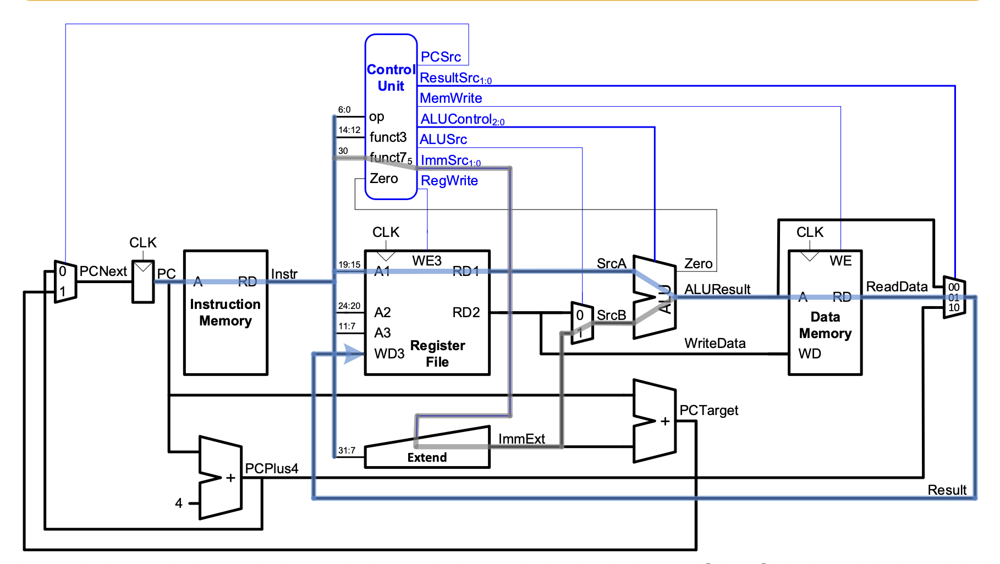

# RISC-V Core

The core follows this block diagram.

Image source: *Digital Design & Computer Architecture*, Chapter 7: “Microarchitecture,” by Sarah Harris and David Harris. 

https://pages.hmc.edu/harris/class/e85/DDCArv_Ch7.pdf